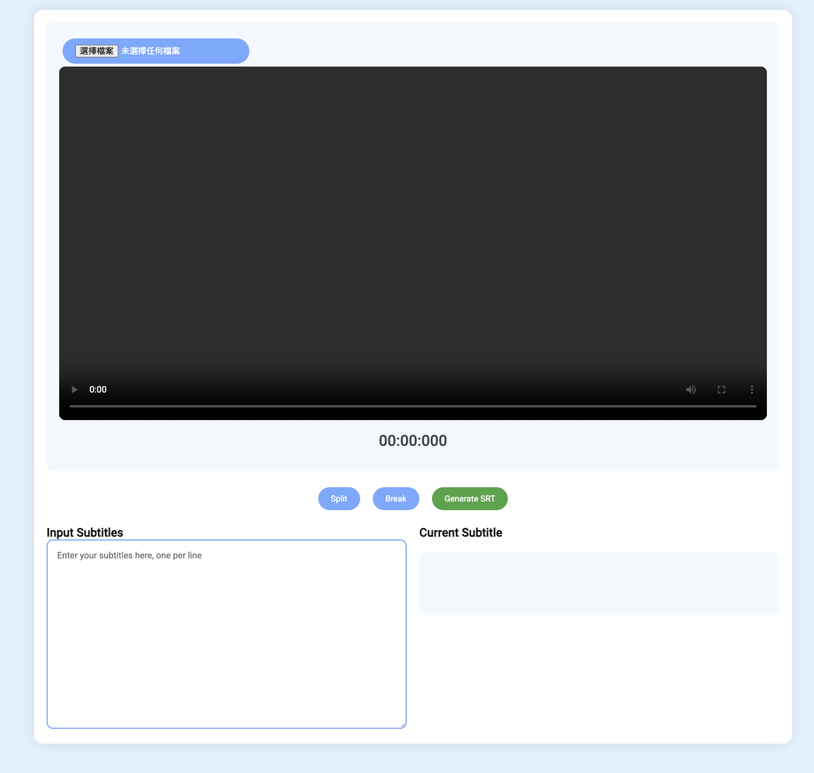

# Video Subtitle Timer: A Powerful Tool for Effortless Subtitle Creation

The Video Subtitle Timer is a user-friendly HTML tool designed to streamline the process of creating accurate and synchronized subtitles for your videos.  This tool eliminates the tedious manual timing often associated with subtitling, allowing you to focus on the content itself.

Traditional subtitle creation often involves painstakingly reviewing video footage and manually entering timestamps.  This is time-consuming, prone to errors, and can be incredibly frustrating.  The Video Subtitle Timer offers a significantly improved workflow **that essentially eliminates manual timing**. All you have to do is **play the video and click as you go.**

## Getting Started: A Step-by-Step Tutorial

  

1. **Access the Tool:** Open the link in Releases.  You should see the Video Subtitle Timer interface.  

2. **Upload Your Video:** Click the "Upload Video" button on the top left and select the video file you wish to subtitle.  

3. **Input Your Subtitles:** In the large text box on the right, enter your premade script, each on a new line. 

4. **Timing Your Subtitles:** As you play the video, a time bar will appear, displaying the current playback time (mm:ss:ms).  As the video plays, click the "Split" button to mark the end of a subtitle section. The tool automatically records the timestamp. To indicate a break in subtitles (no subtitles displayed for a period), click the "Break" button. Clicking "Unbreak" will proceed the subtitles to the next line.

5. **Generating the SRT File:** Once you have timed all your subtitles, click the "Generate SRT" button.  The tool will create an SRT file containing your subtitles and their corresponding timestamps.  You can then download this file.

6. **Using Your SRT File:**  Import the downloaded SRT file into your video editing software or video player to add subtitles to your video.

**Here's an example video that I made with this tool (I apologise for the low quality)**:

https://github.com/user-attachments/assets/0421650e-c347-43e7-bd39-35f8f3bc3708

We hope that Video Subtitle Timer becomes a valuable asset in your video production workflow.  If you encounter any problems or have suggestions for improvement, please don't hesitate to contact me.
